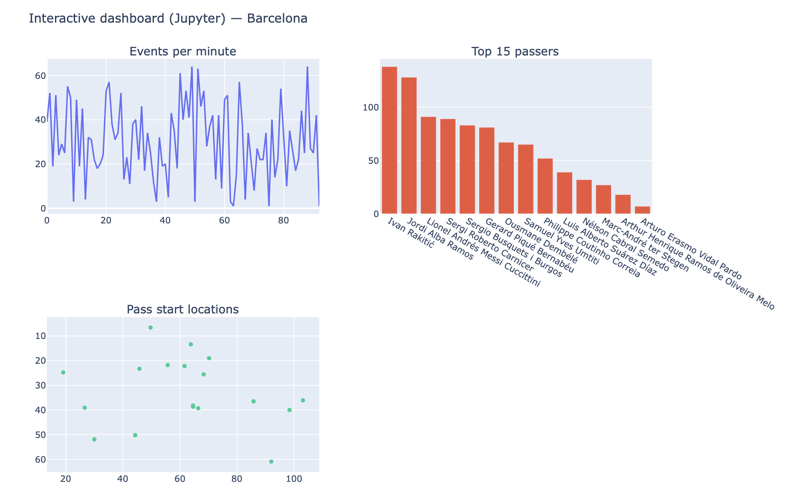

# StatsBomb JSON Exploration and Pipeline Foundations

## Overview

This repository explores the structure and behaviour of publicly available StatsBomb event data as a foundation for designing an end-to-end football analytics pipeline.

The goal is not advanced modelling, but rather to understand:

- How raw event data is structured  
- How nested JSON can be flattened into clean tabular formats  
- How structured outputs behave inside an interactive dashboard layer  

This work forms the early architectural thinking for a future MSc thesis project focused on applied football analytics and pipeline design.

---

## Data Source

The data used in this repository comes from the publicly available StatsBomb Open Data repository.

StatsBomb event data is provided in JSON format, where each match is represented as a list of event objects. Each event corresponds to a single on-pitch action or state change, such as:

- Pass  
- Shot  
- Duel  
- Possession change  
- Lineup declaration  

This structure makes JSON suitable as a raw ingestion format but requires transformation for downstream analytical use.

---

## Exploration Phase

The following areas were explored:

- StatsBomb open data folder structure and file conventions  
- Inspection of raw event-level JSON  
- Identification of key fields such as event type, team, player, timestamp, location, and possession  
- Examination of nested objects for complex actions (passes, shots, tactical structures)  
- Extraction of Starting XI information from event data  
- Creation of basic exploratory visualisations, including:
  - Shot location plots  
  - Pass maps  
  - Event timelines  

The focus was on schema understanding and abstraction rather than deep statistical modelling.

---

## Analysis-Ready Tables

To simulate the transformation stage of an analytics pipeline, raw JSON was flattened into two structured tables:

### `events_basic`

One row per event with contextual fields such as:

- `match_id`  
- `event_id`  
- `minute` / `second`  
- `team`  
- `player`  
- `event type`  
- `location`  

### `passes`

One row per pass event containing:

- start and end coordinates  
- passer and recipient  
- pass outcome  
- length and angle  

These tables represent the kind of structured data that would later be stored in a relational database within a full analytics pipeline.

---

## Interactive Dashboard Layer

To test how well the structured outputs behave in a consumption environment, the CSV tables were loaded into an interactive Plotly dashboard built inside Jupyter.

The dashboard includes:

- Team and player filters  
- Events per minute timeline  
- Pass counts by player  
- Pass start location visualisation  

This stage demonstrates how upstream data engineering decisions directly affect downstream usability. Because the tables were clean and consistently structured, no additional transformation was required in the dashboard layer.

Conceptually, this represents the final stage of the pipeline:

```
Raw JSON → Python processing → Structured tables → Interactive dashboard
```
### Dashboard Preview


---

## Outputs

The `outputs` folder contains:

- Flattened CSV tables  
- Basic static visualisations  
- Artefacts used to validate structure and schema  

These files illustrate the transition from raw JSON ingestion to analysis-ready data.

---

## Relevance to Future Work

This exploratory work clarifies:

- The assumptions required at the ingestion stage  
- The minimum viable schema for football event data  
- How nested JSON must be flattened and validated  
- How clean upstream modelling simplifies downstream visualisation  

These insights will inform future stages of the MSc thesis, including:

- Data ingestion design  
- Database schema modelling  
- Analytical workflows  
- Interactive reporting environments  
